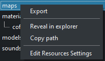

# Game Resources Exporter v0.92

The game can have a huge number of models, textures and other resources that need to be edited and constantly exported to the desired format that the engine reads.
Doing all this manually is boring, long and generally distracts from the creative process. It is better to entrust this task to an automatic exporter, besides - strict export rules will provide a more stable architecture for storing resources.
This exporter detects file changes in real time, identifies them and exports them according to the specified rules. It uses separate folders, one for raw resources whose changes will be observed, and one for exported files that you use in the game.
The exporter of blend projects was focused on [Godot](https://godotengine.org ), but it's not a problem to use it in a different way - for example, [here is](resources_exporter/plugins/source_game) a plugin for exporting resources, including models, for *Source* games.

<div style="text-align:center; height:400px;"></div>

## Features

* Handy GUI client
* Expandable Blender project exporter.
* Individual settings and functions performed for resources.
* Tracking changes in the file system.
* Extension with plugins.
* One program for many individual projects.

<br/>

## Plugins

* ### [Game Resource Exporter for Source games](resources_exporter/plugins/source_game)

<br/>

## Requirements

* [Python >= 3.9](https://www.python.org/downloads/).
* [ImageMagic](https://imagemagick.org/script/download.php). For manipulating images.
* \+ Plugin requirements, if any.

</br>

<details>
<summary>
exporter_config.json
</summary>

```json
{
    "image_magic_cmd": "convert",
    "raw_folder": "resources",
    "output_folder": "project/resources",
    "game_root": "project",
    "verbose": true,
    "plugins": []
}
```

</details>

<details>
<summary>
Example of a file system
</summary>

    .
    |   exporter_config.json
    |   files_registry.json
    |
    +---resources                                    (raw resources folder)
    |   +---models
    |   |   \---tools
    |   |           macro_exploiter.blend
    |   |           macro_exploiter.psd
    |   |           macro_exploiter_emission.psd
    |   |
    |   \---ui
    |            game_icon.psd
    |            icon_export.export.json
    |
    \---project
        \---resources                                (fully generated)
            +---models
            |   \---tools
            |           macro_exploiter.obj
            |           macro_exploiter.png
            |           macro_exploiter.tscn
            |           macro_exploiter_emission.png
            |           macro_exploiter_icon.png
            |           macro_exploiter_phy_collision_shape.tscn
            |           macro_exploiter_rigid_body.tscn
            |           mat_macro_exploiter.tres
            |           mat_snow.tres
            |
            \---ui
                    game_icon.ico
                    game_icon.png

</details>

</br>

# Getting Started

## Installation

    > git clone https://github.com/AshenHermit/game-resources-exporter.git
    > cd game-resources-exporter
    > pip install -r requirements.txt

## Launch

    > python exporter.py

<div style="height:128px;"></div>

A project selection window will appear. Here you can open new and previously opened work folders. Also, using the context menu, you can delete or open the directory folder in the list.
Click *Open Project Folder*, select the desired working directory.

Two files will be created in the selected directory:
* `exporter_config.json` - the configuration of the exporter. It contains the global values used by the exporter and plugins in the work. It is important to pay attention to the following fields:
* `raw_folder` is the folder where raw resources are located (`.psd`, `.blend`, `.qc`...), it is its contents that are displayed in the file system panels in the exporter window.
* `output_folder` is the folder where raw resources will be exported (to `.png`, `.obj`, `.mdl`...), keeping its path relative to `raw_folder`.
* `game_root` is the root of the game, an equally important parameter, although the places where it is used are a bit chaotic. For example, the paths of the resources specified in the `.tres` materials when exporting for *Godot*, and arguments for programs for compiling *Source* models depend on it.
* `plugins` - an array of identifiers of active plugins that the exporter should use in his work. The identifiers are equal to the names of the plugin folders, in the directory `resources_exporter/plugins/`.
* `run_resources_exporter.bat` is just a file for quick launch of the exporter in this directory.

<div style="height:128px;"></div>

The main window of the exporter will also open.
### What`s here where
* On the right is the folder panel. The file system of the `raw_folder` directory specified in the *config* is displayed.
* In the center is a panel of files in the selected folder.
* On the right - the export panel, the export results, the general console, the button for enabling/disabling the scanner and the button for exporting updated files.
* Scanner - detects file changes in real time and exports.
* Export of updated files is the export of all files whose last modification time is older than the time of their last export.

### Top panel:

* `File` - <div></div>
* `Plugins`
* *Create New Plugin* - create a new plugin. You can choose something like a template that will be applied in the new plugin. For example, using `Using Blender Export`, in the new plugin you can find everything you need to quickly write your own model class, with its own export algorithm. Templates are stored [here](resources_exporter/plugin_templates).

<div></div>

* Next is a list of active plugins and their functions (*commands*).

### Context menu of folders:

<div></div>

* `Export` - export all files only in this folder, not in child folders.
* `Reveal in explorer` - show the folder in explorer.
* `Edit Resources Settings` - opens the local settings file for exporting resources in this folder.

### The context menu of the file:

<div></div>

* `Export` - export the file.
* `Reveal in explorer` - show the file in explorer.
* `Third Section` (*Render .vmt file*) - In this section there are resource commands - functions defined by the plugin, they can be executed.
* `Fourth section` (*Ignore by Observer...*) - This section contains individual file settings, for example, if the `Ignore by Observer` parameter is activated, and if the scanner is active, changes in the file will be ignored by it. These settings are stored in the file `.local.cfg` next to the resources, all settings work only for files located in the same directory with `.local.cfg`.
Here`s what `.local.cfg` might look like:

    <details>
    <summary>Individual settings for each file</summary>

        {
            "settings_map": {
                "wood_ladder.qc": {
                    "observer_ignore": true
                },
                "ladder_nm.psd": {
                    "observer_ignore": true
                }
            }
        }

    </details>

    <details>
    <summary>For everyone .vmf files</summary>

        {
            "settings_map": {
                "*.vmf": {
                    "observer_ignore": true
                }
            }
        }

    </details>

### Keyboard shortcuts
* `Ctrl + F` - search in the folder tree or in the file tree. `Escape` - exit from the search.
* `Ctrl + L` - clears the list of export results or clears the console.


### CLI
<details>
<summary>There is also the CLI, the old console client, now its capabilities are lower than the GUI client.</summary>

    > python exporter_cli.py
    usage: exporter_cli.py [-h] {one,all,init,observe,new_plugin} ...

    positional arguments:
    {one,all,init,observe,new_plugin}
                            sub-command help
        one                 export one resource
        all                 export all resources
        init                init exporter workspace: setup config, make batch file to run exporter
        observe             start observing files changes to export them
        new_plugin          make new plugin

    optional arguments:
    -h, --help            show this help message and exit

</details>

</br>

# Exporting blender files
### How it works
In the *Core* plugin (`resources_exporter/resource_types/core`) in the file [`models.py `](resources_exporter/resource_types/core/models.py ) the resource class *BlenderModel* is defined for export`.blend` files. It runs the `blender` program, so when the blender starts, the project file opens and the *python* script executes [`blender_export/blend_export.py`](resources_exporter/resource_types/core/blender_export/blend_export.py). There is nothing complicated there.
### Basic Facts
* The executable file `blender` should be in the PATH.

* 

In order for the exporter to export the model from the `.blend` file, it is enough to create one collection with the model name, inside which all the necessary objects will be located.
If you call the collection "*model_name*_ref", everything behind the substring "_ref" will be used as the name.
* Games often also require a physical model for each object, for this you can make the same collection, call it "*model_name*_phy" with the geometry of the physical model inside.
* The collection "*Collection*" is ignored.
* If you deactivate or hide the model collection in any way, it will still be exported, this is convenient.
* All modifiers apply.
* The `.blend` file itself does not change during export.
* You can specify parameters for export using *custom properties*, during export these parameters are available directly in the export class, so you can find out the available parameters by looking at the model class, for example, [here](resources_exporter\resource_types\core\blender_export\game_resources.py ), the *ViewModel* class defines the parameters `format`, `render_icon`, `icon_size`, etc. If in the *Object Properties* tab in *Custom Properties* add the fields `format` with the value "glb" and `render_icon` with the value 1 (for *bool* 0-*False* 1-*True*), then when exporting *ref*, the model is exported in the format `.glb`, and the model icon will be rendered next to it -


* It is better to name the materials identically to the name of the texture file.
* For *GODOT*: If the *ref* and *phy* model classes are not overridden by any plugin, when exporting, `.obj` or `.glb` models will be created for each blender collection (except for one named `Collection`), and will also create Godot `.tres` and `.tscn` files for materials, view models, *Collision Shape* objects and physical bodies.

### As a result, the following is available without plugins

* primitive image files, audio files and model files will be simply copied.
* `.psd` will be converted to `.png` or `.ico`.
* Exporting `.blend` will create `.obj` or `.glb` models for each blender collection (except one named `Collection`), and will also create Godot `.tres` and `.tscn` files for materials, view models, *Collision Shape* objects and physical bodies. Icons can also be drawn.

</br>

### Problems that can be received:
* **blend project is not exported, the godot-parser module could not be installed in the Blender python**  
    This often happens due to the lack of write permissions on the Blender Python site-packages folder.  
    Try changing the permissions or run the exporter with administrator rights.

### TODO:
* Separate the export for *Godot* into a separate plugin.
* Write a plugin for blender, or in some other way display a list of available *custom properties*, without looking into the code.