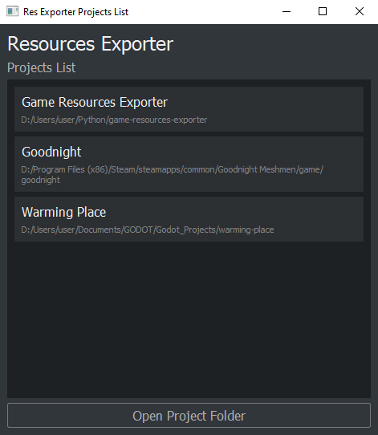
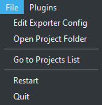
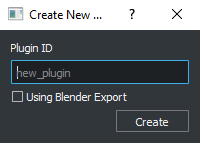
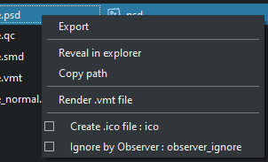
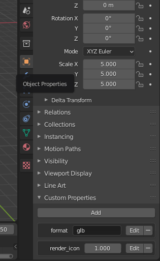

[[IN ENGLISH]](README.en.md)

# Game Resources Exporter v0.92

В игре может быть огромное количество моделей, текстур и других ресурсов, которые нужно редактировать и постояно экспортировать в нужный формат, который читает движок.  
Делать все это вручную скучно, долго и вообще отвлекает от творческого процесса. Лучше доверить эту задачу автоматическому экспортеру, к тому же - строгие правила экспорта обеспечат более стабильную архитектуру хранения ресурсов.  
Этот экспортер обнаруживает изменения файлов в реальном времени, идентифицирует их и экспортирует в соответствии с заданными правилами. Он также использует отдельные папки, одну для сырых ресурсов, изменения которых будут наблюдаться, и одну для экспортированных файлов, которые вы используете в игре.  
Экспортер blend проектов был ориентирован на [Godot](https://godotengine.org), но не проблема использовать его по другому - например, [вот](resources_exporter/plugins/source_game) плагин для экспорта ресурсов, в том числе моделей, для *Source* игр.

<div style="text-align:center; height:400px;"></div>

## Особенности

* Удобный GUI клиент
* Индивидуальный экспортер Blender проектов с  использованием *custom properties* объектов.
* Генерация моделей, физических тел и материалов для Godot.
* Расширение с помощью плагинов.
* Одна программа для многих отдельных проектов.
    
## Плагины

* ### [Экспортер ресурсов для игр на Source](resources_exporter/plugins/source_game)

<br/>

## Требования

* [Python >= 3.9](https://www.python.org/downloads/).
* [ImageMagic](https://imagemagick.org/script/download.php). Для манипуляций с изображениями.
* \+ Требования плагинов, если есть.

</br>

<details>
<summary>
exporter_config.json
</summary>

```json
{
    "image_magic_cmd": "convert",
    "raw_folder": "resources",
    "output_folder": "project/resources",
    "game_root": "project",
    "verbose": true,
    "plugins": []
}
```

</details>

<details>
<summary>
Пример файловой системы
</summary>

    .
    |   exporter_config.json
    |   files_registry.json
    |
    +---resources                                    (папка с сырыми ресурсами)
    |   +---models
    |   |   \---tools
    |   |           macro_exploiter.blend
    |   |           macro_exploiter.psd
    |   |           macro_exploiter_emission.psd
    |   |
    |   \---ui
    |            game_icon.psd
    |            icon_export.export.json
    |
    \---project
        \---resources                                (сгенерировано)
            +---models
            |   \---tools
            |           macro_exploiter.obj
            |           macro_exploiter.png
            |           macro_exploiter.tscn
            |           macro_exploiter_emission.png
            |           macro_exploiter_icon.png
            |           macro_exploiter_phy_collision_shape.tscn
            |           macro_exploiter_rigid_body.tscn
            |           mat_macro_exploiter.tres
            |           mat_snow.tres
            |
            \---ui
                    game_icon.ico
                    game_icon.png

</details>

</br>

# Начало Работы

## Установка

    > git clone https://github.com/AshenHermit/game-resources-exporter.git
    > cd game-resources-exporter
    > pip install -r requirements.txt

## Запуск
    > python exporter.py

<div style="height:128px;"></div>
Появится окно выбора проектов. Здесь можно открывать новые и ранее открытые рабочие папки. Так же с помщью контекстного меню можно удалить или открыть папку директории в списке.  
Нажимаем *Open Project Folder*, выбираем нужную рабочую директорию.

Создадутся два файла в выбранной директории:
* `exporter_config.json` - конфигурация экспортера. В ней находятся глобальные значения используемые экспортером и плагинами в работе. Важно обратить внимание на следующие поля:
    * `raw_folder` - это папка где находятся сырые ресурсы (`.psd`, `.blend`, `.qc`...), именно ее содержимое и отображается в панелях файловой системы в окне экспортера.
    * `output_folder` - это папка куда сырые ресурсы будут экспортированы (в `.png`, `.obj`, `.mdl`...), сохраняя свой путь относительно `raw_folder`.
    * `game_root` - это корень игры, не менее важный параметр, хотя места его использования немного хаотичны. От него зависят, например, пути ресурсов указанных в `.tres` материалах при экспорте для *Godot*, и аргументы для программ для компиляции *Source* моделей.
    * `plugins` - массив идентификаторов активных плагинов, которые эксортер должен использовать в работе. Идентификаторы равны названиям папок плагинов, в директории  `resources_exporter/plugins/`.
* `run_resources_exporter.bat` - просто файл для быстрого запуска экспортера в этой директории.

<div style="height:128px;"></div>

Также откроется основное окно экспортера.
### Че тут где
* Справа - панель папок. Отображается файловая система директории `raw_folder`, указанной в *конфиге*.
* В центре - панель файлов в выбранной папке.
* Справа - панель экспорта, результаты экспорта, общая консоль, кнопка для включения/отключения сканнера и кнопка экспорта обновленных файлов. 
    * Сканнер - обнаруживает изменения файлов в реальном времени и экспортирует. 
    * Экспорт обновленных файлов - это экспорт всех файлов, у которых время последнего изменения старше времени их последнего экспорта.

### Верхняя панель:

* `File` - <div></div>
* `Plugins`
    * *Create New Plugin* - создать новый плагин. Можно выбрать что-то типо шаблона, который будет применен в новом плагине. Например, используя `Using Blender Export`, в новом    плагине можно будет найти все необходимое для быстрого написания своего класса модели, со своим алгоритмом экспорта. Шаблоны хранятся [тут](resources_exporter/plugin_templates).

        <div></div>

    * Далее идет список активных плагинов и их функции (*commands*).

### Конекстное меню папок:

<div></div>

* `Export` - экспортировать все файлы только в этой папке, не в дочерних папках.
* `Reveal in explorer` - показать папку в проводнике.
* `Edit Resources Settings` - открывает файл локальных настроек для экспорта ресурсов в этой папке.

### Конекстное меню файла:

<div></div>

* `Export` - экспортировать файл.
* `Reveal in explorer` - показать файл в проводнике.
* `Третья секция` (*Render .vmt file*) - В этой секции находятся команды ресурса - функции определяемые плагином, их можно выполнять.
* `Четвертая секция` (*Ignore by Observer...*) - В этой секции находятся индивидуальные настройки файла, например, если активирован параметр `Ignore by Observer`, и если сканнер активен, изменения в файле им будут проигнорированы. Эти настройки храняться в файле `.local.cfg` рядом с ресурсами, все настройки работают только для файлаов находящихся в одной директории с `.local.cfg`.  
Вот как может выглядеть `.local.cfg`:

    <details>
    <summary>Индивидуальные настройки для каждого файла</summary>

        {
            "settings_map": {
                "wood_ladder.qc": {
                    "observer_ignore": true
                },
                "ladder_nm.psd": {
                    "observer_ignore": true
                }
            }
        }

    </details>

    <details>
    <summary>Для всех .vmf файлов</summary>

        {
            "settings_map": {
                "*.vmf": {
                    "observer_ignore": true
                }
            }
        }

    </details>

### Горячие клавиши
* `Ctrl + F` - поиск в дереве папок или в дереве файлов. `Escape` - выход из поиска.
* `Ctrl + L` - очищение списка результатов экспорта или очищение консоли.

### CLI
<details>
<summary>Есть еще CLI, старый консольный клиент, сейчас его возможности ниже чем GUI клиент.</summary>

    > python exporter_cli.py
    usage: exporter_cli.py [-h] {one,all,init,observe,new_plugin} ...

    positional arguments:
    {one,all,init,observe,new_plugin}
                            sub-command help
        one                 export one resource
        all                 export all resources
        init                init exporter workspace: setup config, make batch file to run exporter
        observe             start observing files changes to export them
        new_plugin          make new plugin

    optional arguments:
    -h, --help            show this help message and exit

</details>

</br>

# Экспорт blender файлов
### Как это работает
В *Core* плагине (`resources_exporter/resource_types/core`) в файле [`models.py`](resources_exporter/resource_types/core/models.py) определен класс ресурса *BlenderModel* для экспорта `.blend` файлов. Он запускает программу `blender`, так что когда блендер запустится, откроется файл проекта и выполнится *python* скрипт [`blender_export/blend_export.py`](resources_exporter/resource_types/core/blender_export/blend_export.py). Там ничего сложного нет.
### Основные факты
* Исполняемый файл `blender` должет быть в PATH.

* 
Чтобы экспортер экспортировал модель из `.blend` файла - достаточно создать одну коллекцию с именем модели, внутри которой будут находится все нужные объекты.
Если назвать коллекцию "*имя_модели*_ref", в качестве имени будет использовано все что позади подстроки "_ref".
* В играх часто требуется также физическая модель для каждого объекта, для этого можно сделать такую же коллекцию, назвать ее "*имя_модели*_phy" с геометрией физической модели внутри.
* Коллекция "*Collection*" игнорируется.
* Если каким либо образом деактивировать или скрыть коллекцию модели, она все равно будет экспортироваться, это удобно.
* Все модификаторы применяются.
* Сам `.blend` файл во время экспорта не изменяется.
* Можно указывать параметры для экспорта при помощи *custom properties*, во время экспорта эти параметры доступны непосредственно в классе экспорта, поэтому узнать доступные параметры можно посмотрев на класс модели, например, [тут](resources_exporter\resource_types\core\blender_export\game_resources.py), в классе *ViewModel* определены параметры `format`, `render_icon`, `icon_size` и т.д. Если во вкладке *Object Properties* в *Custom Properties*  добавить поля `format` со значением "glb" и `render_icon` со значеним 1 (для *bool* 0-*False* 1-*True*), то при экспорте *ref* модель экспортируется в формате `.glb`, а рядом отрендерится иконка модели - 
 
    

* Лучше называть материалы идентично названию файла текстуры.
* Для *GODOT*: Если классы *ref* и *phy* моделей не переопределены никаким плагином, при экспорте будут созданы модели `.obj` или `.glb` для каждой коллекции blender (кроме одной с именем 'Collection'), а также создаст файлы Godot `.tres` и `.tscn` для материалов, view моделей, *Collision Shape* объектов и физических тел.

### В итоге без плагинов доступно следующее

* примитивные файлы изображений, аудио файлы и файлы моделей будут просто скопированы.
* `.psd` будет конвертирован в `.png` или `.ico`.
* Экспорт `.blend` создаст модели `.obj` или `.glb` для каждой коллекции blender (кроме одной с именем `Collection`), а также создаст файлы Godot `.tres` и `.tscn` для материалов, view моделей, *Collision Shape* объектов и физических тел. Также могут быть отрисованы иконки.

</br>

### TODO:
* Отделить экспорт для *Godot* в отдельный плагин.
* Написать плагин для блендера, или каким-либо другим способом выводить список доступных *custom properties*, без заглядывания в код.